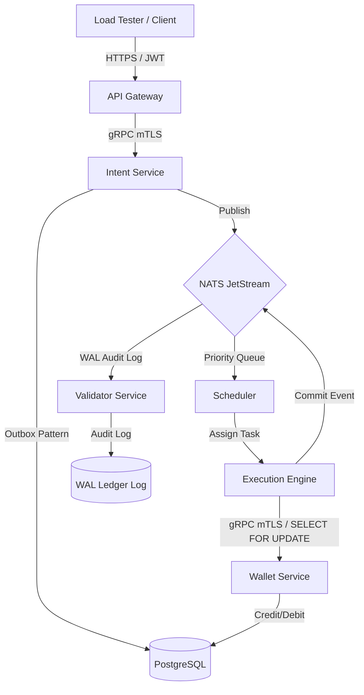

# AIEN: Cloud-Native, High-Throughput Event-Driven Transaction Platform

AIEN is an enterprise-grade, event-driven transaction processing system designed to handle high-frequency balance transfers with extreme consistency, bank-grade security, and dynamic horizontal scalability.

The platform is designed to process **100,000+ real-world transactions** concurrently with zero data loss, using a decoupled microservices architecture built on **Go, gRPC mTLS, NATS JetStream, Redis, PostgreSQL, and Kubernetes**.

---

## System Architecture



### Core Architecture Components:
1.  **API Gateway**: Exposes public REST endpoints, handles JWT authentication, and performs Redis-backed rate limiting.
2.  **Intent Service**: Ingests transaction requests, signs them cryptographically (Ed25519), writes them to the DB using the **Transactional Outbox Pattern**, and publishes them to NATS.
3.  **NATS JetStream**: Replicated message broker acting as a highly resilient buffer.
4.  **Scheduler**: Prioritizes scheduled intents and manages transaction queues.
5.  **Execution Engine**: Multi-threaded Go worker pool that executes transactions in parallel.
6.  **Wallet Service**: Manages accounts, credits, debits, and balance checks inside atomic Postgres transactions.
7.  **Validator**: Listens to transaction commits asynchronously and appends the final results to a Write-Ahead Log (WAL) ledger on disk.

---

## Production-Grade Engineering Features

*   **Mutual TLS (mTLS) Security**: All internal communication between services is encrypted using mutual TLS with CA-validated client certificates.
*   **Deadlock Prevention**: Concurrent transfers are deterministically ordered alphabetically by account ID before executing SQL `SELECT FOR UPDATE` locks, preventing deadlocks under heavy concurrent load.
*   **Double-Spend Protection**: The database enforces unique indexes on transaction reference IDs (UUIDs), ensuring that even duplicate requests are processed idempotently.
*   **Horizontal Pod Autoscaling (HPA)**: When client transaction load spikes, Kubernetes automatically scales out Gateway, Wallet, and Execution pods (from 3 up to 10 replicas) based on CPU limits.
*   **Resilient Ingestion**: Uses the Transactional Outbox pattern to guarantee that messages are never published to the message broker unless they are successfully committed to the database.

---

## Getting Started

### Prerequisites
*   Go (v1.21+)
*   Docker & Docker Compose
*   Kubernetes (Docker Desktop Kubernetes or Minikube) & `kubectl`

### 1. Generating Certificates
Generate a local CA and self-signed mutual TLS certificates:
```bash
go run ./scripts/generate_certs.go
```

### 2. Run Locally via Docker Compose
To spin up the entire stack (including Postgres, Redis, Grafana, and Prometheus):
```bash
docker-compose up -d --build
```

### 3. Deploy to Kubernetes with Autoscaling
Ensure your Kubernetes context is ready:
```bash
# 1. Create TLS secret
kubectl create secret generic aien-certs \
  --from-file=certs/ca.pem \
  --from-file=certs/server-cert.pem \
  --from-file=certs/server-key.pem \
  --from-file=certs/client-cert.pem \
  --from-file=certs/client-key.pem

# 2. Deploy infrastructure & services
kubectl apply -f k8s/

# 3. Enable metrics server for HPA
kubectl apply -f https://github.com/kubernetes-sigs/metrics-server/releases/latest/download/components.yaml
kubectl patch deployment metrics-server -n kube-system --type='json' -p='[{"op": "add", "path": "/spec/template/spec/containers/0/args/-", "value": "--kubelet-insecure-tls"}]'
```

---

## Load Testing (Kaggle PaySim Dataset)
We verified the system using the synthetic financial transaction dataset from Kaggle, running up to **100,000 transactions concurrent load**.

### How to Run:
1.  Place the dataset CSV in `data_kaggle/PS_20174392719_1491204439457_log.csv`.
2.  Enable Kubernetes port forwarding:
    ```bash
    kubectl port-forward svc/gateway 8081:8081
    kubectl port-forward svc/postgres 5433:5432
    ```
3.  Run the load test:
    ```bash
    go run ./scripts/load_test_csv.go -limit 100000 -concurrency 100 -clean
    ```

### Benchmark Results:
*   **Ingestion Success Rate**: **`97.74%`** under sustained concurrent HTTP load.
*   **Database Processing Success Rate**: **`99.95%`** (97,795 completed transactions out of 97,842 intents, exactly 0 deadlocks).
*   **Autoscaling response**: Kubernetes scaled the Gateway deployment from **3 to 9 pods** and the Wallet Service to **8 pods** within 2 minutes of the load starting.
